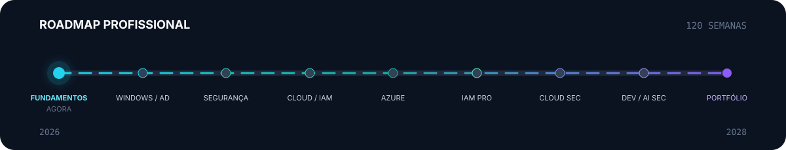

<div align="center">



[](https://www.linkedin.com/in/marcos-martins-493a63257)
[](https://github.com/markzioio/tech-labs)
[](https://github.com/markzioio)

</div>

## Olá, eu sou o Marcos

Estudante de tecnologia construindo uma base prática em **Linux, redes, Git, Python e automação**. Minha direção profissional é evoluir de infraestrutura e cloud support para **IAM, Cloud Security e segurança de aplicações de IA**.

Não uso o perfil como uma lista de palavras-chave: uma tecnologia só vira competência comprovada quando existe código, teste, laboratório, runbook ou documentação reproduzível.

## Agora

| Foco | Ciclo de trabalho | Meta |
|:---|:---|:---|
| **Linux · terminal e filesystem** | Estudar → praticar → verificar → documentar | Construir fundamentos profissionais sem atalhos |

<div align="center">



</div>

O plano tem **840 dias, 120 semanas e 9 fases**, de setembro de 2026 a dezembro de 2028. O avanço acontece por checkpoints semanais e evidências — não apenas por horas assistidas.

## Base técnica

<div align="center">

### Em uso e estudo atual


### Próximas camadas do roadmap


</div>

<details>
<summary><strong>Ver a trilha técnica completa</strong></summary>

`Linux` → `Redes` → `Git` → `Python` → `Bash` → `Windows` → `PowerShell` → `Active Directory` → `Segurança` → `Azure` → `Microsoft Entra ID` → `IAM` → `Terraform` → `Docker` → `DevSecOps` → `AppSec` → `AI Security`

> Os itens futuros indicam direção de estudo. Eles não representam domínio profissional ou certificação concluída.

</details>

## Projeto em destaque

<table>
<tr>
<td width="65%">

### [tech-labs](https://github.com/markzioio/tech-labs)

Meu laboratório público de aprendizado orientado a evidências. Reúne scripts, experimentos, runbooks, diagramas e projetos que outra pessoa consegue entender e reproduzir.

**Fase atual:** fundamentos de Linux<br>
**Publicação:** somente artefatos úteis e revisados<br>
**Segurança:** sem credenciais, dados pessoais ou testes em terceiros

</td>
<td width="35%" align="center">


</td>
</tr>
</table>

### Entregas que vão nascer da trilha

| Fundamentos | Infraestrutura e identidade | Segurança avançada |
|:---|:---|:---|
| Network Diagnostics Toolkit | Corporate IT Lab | Secure Cloud Platform |
| Security Audit Toolkit | IAM Automation Portfolio | AI Security Lab |
| Automação Linux/Python | Secure Azure Architecture | Capstone híbrido/cloud |

Cada projeto só será promovido para destaque depois de funcionar, estar documentado e poder ser demonstrado sem expor informações sensíveis.

## Meu padrão de trabalho

```text
APRENDER  →  CONSTRUIR  →  QUEBRAR  →  ENTENDER  →  CORRIGIR  →  DOCUMENTAR
```

- **Evidência antes de afirmação** — resultados verificáveis sustentam cada competência.
- **Segurança desde o primeiro commit** — segredos e dados pessoais ficam fora do Git.
- **Documentação que resolve dúvidas** — problema, decisões, execução, falhas e limites.
- **Consistência sustentável** — fundamentos antes de ferramentas avançadas.

## Vamos conversar

Estou aberto a conexões profissionais, troca de conhecimento e oportunidades compatíveis com meu nível atual.

<div align="center">

[](https://www.linkedin.com/in/marcos-martins-493a63257)
[](https://github.com/markzioio/tech-labs)

<sub>Construindo em público sem transformar planos futuros em experiência presente.</sub>

</div>
