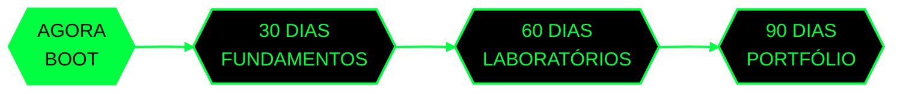

  

  

   

  

    

  
  
  
  

 

**Marcos Luiz Martins** — estudante no início da formação em **Cibersegurança**, com direção definida para **Blue Team e Segurança Defensiva**.

Este GitHub será meu **currículo vivo**: cada conhecimento apresentado aqui deverá possuir uma evidência — anotação, laboratório, análise ou projeto. A jornada começa do zero e será construída com transparência durante os próximos **2 a 3 anos**.

  
  
  
  

 

Os primeiros **90 dias** serão divididos em três marcos. Cada etapa desbloqueia uma camada nova: fundamentos, prática orientada e as primeiras evidências de portfólio.

  

<!-- ATUALIZAÇÃO MANUAL: mova a classe current para o marco atual e use future nos demais. -->

  
  
  

 

 Segurança da Informação, Tríade CIA, NIST, Linux, Git, redes e TCP/IP.  
 Logs, SIEM, Wireshark, IDS/IPS, CVEs, EDR e Threat Intelligence.  
 Resposta a incidentes, forense, malware, Volatility, MITRE ATT&CK e Threat Hunting.  
 Hardening, cloud, Zero Trust, phishing, ransomware, governança e SOC simulado.

**Próxima etapa:** aprofundamento, laboratórios, projetos defensivos, portfólio e preparação profissional.

 

Aqui entrarão somente trabalhos realmente estudados e produzidos: relatórios, análises de logs, capturas de tráfego, regras de detecção, playbooks e projetos defensivos.

  

<!--
TEMPLATE PARA REPOSITÓRIOS FUTUROS

### [`NOME DO PROJETO`](https://github.com/markzioio/NOME-DO-REPOSITORIO)
Descrição curta: problema, prática realizada e resultado obtido.

`STATUS: CONCLUÍDO` · `ÁREA: BLUE TEAM` · `EVIDÊNCIA: RELATÓRIO/LAB/PROJETO`

---

### [`SEGUNDO PROJETO`](https://github.com/markzioio/SEGUNDO-REPOSITORIO)
Descrição curta e objetiva do projeto.
-->

 

  

    

  

   

  

Contribuições incluem atividades como commits, issues e pull requests. O conteúdo dos repositórios será a evidência real dos estudos.

 

  

    

  

