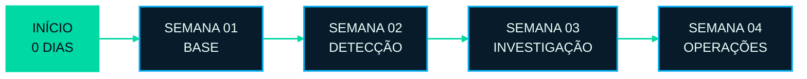

  

  

    

  
  
  
  
  

 

Sou **Marcos Luiz Martins**, estudante no início da formação em **Cibersegurança**, direcionando minha carreira para **Blue Team e Segurança Defensiva**.

Este perfil funciona como um **currículo vivo**: um registro público da minha evolução, criado para mostrar não apenas o que estou estudando, mas também como aplico cada conhecimento em anotações, laboratórios, análises e projetos.

Minha construção será gradual, transparente e baseada em evidências. Tecnologias só serão apresentadas como conhecimento adquirido depois de estudadas e praticadas.

  
  
  
  

 

O primeiro passo será um ciclo introdutório de **30 dias**, organizado em quatro semanas. O objetivo não é dominar a área em um mês, mas construir vocabulário técnico, disciplina de estudo e as primeiras evidências para o portfólio.

  

<!-- ATUALIZAÇÃO MANUAL: mova a classe active para a semana atual e use next nas demais. -->

 

  
Segurança da Informação, Blue Team, Tríade CIA, NIST, Linux, redes TCP/IP, introdução a SIEM e análise de logs.

  
Wireshark, IDS/IPS, Snort, Threat Intelligence, vulnerabilidades, CVEs, análise básica de malware e EDR.

  
Resposta a incidentes, forense digital, Volatility, Threat Hunting, MITRE ATT&CK, playbooks e simulação de incidente.

  
Hardening de Linux e redes, segurança em nuvem, Zero Trust, phishing, ransomware, governança e projeto final de SOC simulado.

### Conteúdos e ferramentas no plano

  
  
  
  
  
  
  

 

Os repositórios deste perfil serão organizados como evidências profissionais. Cada projeto deverá apresentar **contexto, objetivo, procedimento, resultado e aprendizado**.

- Anotações técnicas com linguagem própria e referências.
- Relatórios de laboratórios, tráfego, logs e incidentes simulados.
- Regras de detecção, playbooks e configurações criadas durante os estudos.
- Scripts de apoio e projetos defensivos desenvolvidos conforme a evolução.

  
   
  

<!--
TEMPLATE PARA PROJETOS FUTUROS

### [Nome do projeto](https://github.com/markzioio/NOME-DO-REPOSITORIO)
Descrição curta do problema, da prática realizada e do resultado alcançado.

STATUS: CONCLUÍDO | ÁREA: BLUE TEAM | EVIDÊNCIA: RELATÓRIO/LAB/PROJETO
-->

 

  

    

  

   

  

As métricas mostram contribuições públicas do GitHub. A validação do aprendizado estará no conteúdo e na qualidade dos repositórios publicados.

 

  

    

  
  

